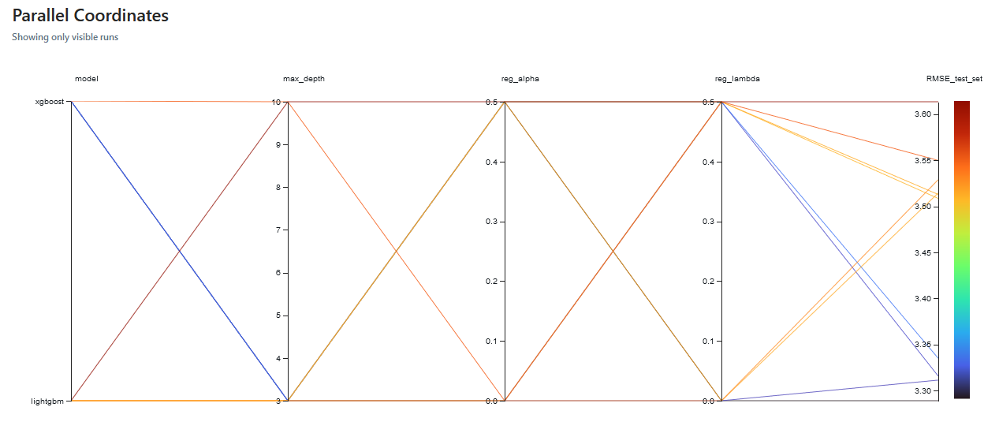
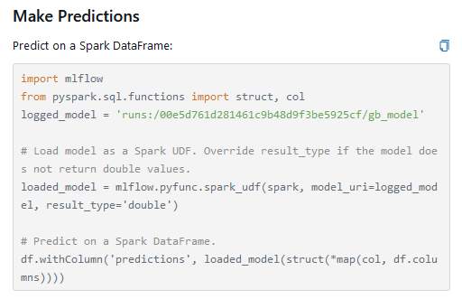

# MLflow to time series data  
  
## Overview  
MLflow is a well-established tool for monitoring ML models.  
This project aims to provide a hands-on application of this tool to monitor the pipeline of a model that will predict the price of any stock available in the YFinance library.  
In this case, I used the "close" price and volume of the asset for simplicity.   
  
## Transformation  
I created lag columns of the close price following the parameters of the class I created to prepare the dataset for use. The default number of lags was set to 30, resulting in the dataset being organized into sequences of 30 consecutive close prices and their respective volumes:  
  
Input data:  
| Date       | Open     | High     | Low      | Close    | Adj Close | Volume    |
|------------|----------|----------|----------|----------|-----------|-----------|
| 2015-12-21 | 0.81225  | 0.82325  | 0.805    | 0.8225   | 0.802859  | 284216000 |
| 2015-12-22 | 0.825    | 0.8315   | 0.81825  | 0.82325  | 0.803591  | 130012000 |
| 2015-12-23 | 0.8245   | 0.82975  | 0.823    | 0.8265   | 0.806764  | 122524000 |
| 2015-12-24 | 0.824    | 0.83125  | 0.82275  | 0.82925  | 0.809448  | 52448000  |
| 2015-12-28 | 0.8205   | 0.8285   | 0.809    | 0.8285   | 0.808716  | 142024000 |
  
```python   
def lag_data(self, df:pd.DataFrame=None, lags:int=30, column:str = 'Close'):
        values = []
        volume = []
        for i in range(0,len(df)-lags,lags):
            v = df['Volume'].values[i:i+lags]
            d = df[column].values[i:i+lags]
            volume.append(v)
            values.append(d)
        val_array = np.array(values)
        vol_array = np.array(volume)
        val_arrayT = val_array.T
        vol_arrayT = vol_array.T
        val_dict = {f"t{i}": val_arrayT[i] for i in range(0, lags)}
        vol_dict = {f"t_vol{i}": vol_arrayT[i] for i in range(0, lags)}
        val_df = pd.DataFrame(val_dict)
        vol_df = pd.DataFrame(vol_dict)

        return val_df, vol_df
```
  
The number of days ahead to be predicted is also tunable and the default is 15 days out of those 30 lag days.  
For instance:  
|      |   t0   |   t1    |   t2    |   t3    |   t4    |   t5    | ... |   t24   |   t25   |   t26   |   t27   |   t28   |   t29   |
|------|--------|---------|---------|---------|---------|---------|-----|---------|---------|---------|---------|---------|---------|
|  0   | 0.8225 | 0.82325 | 0.8265  | 0.82925 | 0.8285  | 0.842   | ... | 0.709   | 0.70125 | 0.73225 | 0.7325  | 0.7015  | 0.705   |
|  1   | 0.70525| 0.66075 | 0.6305  | 0.63725 | 0.63575 | 0.6325  | ... | 0.792   | 0.8055  | 0.8075  | 0.8035  | 0.8275  | 0.8205  |
|  2   | 0.84525| 0.84775 | 0.84625 | 0.86075 | 0.862   | 0.87075 | ... | 0.90675 | 0.91125 | 0.912   | 0.93275 | 0.905   | 0.88825 |
|  3   | 0.9    | 0.88925 | 0.869   | 0.87425 | 0.88325 | 0.882   | ... | 1.156   | 1.15825 | 1.1545  | 1.1845  | 1.155   | 1.16975 |
|  4   | 1.172  | 1.184   | 1.18875 | 1.168   | 1.189   | 1.18175 | ... | 1.338   | 1.3555  | 1.3305  | 1.36675 | 1.392   | 1.41575 |  
  
[5 rows x 30 columns]  
   
Volume:  
|      |   t_vol0   |   t_vol1   |   t_vol2   |   t_vol3   |   t_vol4   | ... |   t_vol25  |   t_vol26  |   t_vol27  |   t_vol28  |   t_vol29  |
|------|------------|------------|------------|------------|------------|-----|------------|------------|------------|------------|------------|
|  0   | 284216000  | 130012000  | 122524000  | 52448000   | 142024000  | ... | 276776000  | 310504000  | 289884000  | 341908000  | 326772000  |
|  1   | 348140000  | 600428000  | 608852000  | 425372000  | 335800000  | ... | 277400000  | 190312000  | 226216000  | 363644000  | 353680000  |
|  2   | 545512000  | 337780000  | 242012000  | 429008000  | 244956000  | ... | 191972000  | 214536000  | 352396000  | 381224000  | 321904000  |
|  3   | 256076000  | 224024000  | 525764000  | 246884000  | 183240000  | ... | 193400000  | 234616000  | 472168000  | 400024000  | 475588000  |
|  4   | 298344000  | 301036000  | 246456000  | 471000000  | 293768000  | ... | 296460000  | 361308000  | 315768000  | 312528000  | 514508000  |
  
##  Training  
The models choosen for this project are XGBoost and LightGBM because of the capacity if these models to capture complex patterns. It is achieved because GBM is a ensamble method, meaning that it is composed of multiple decision trees in series (different than random forest). Each model is trained to correct the erros of the previous decision tree.  
  
### Hyperparameters used:
- Number of Estimators:  
The number of trees (models) that will be built in the boosting process. Each tree is built sequentially, and the predictions from all trees are combined to make the final prediction.
  
- Learning Rate:  
Learning rate (also known as shrinkage) is a hyperparameter that controls the contribution of each tree (or weak learner) to the ensemble. It scales the impact of each tree's prediction on the final prediction.  
  
### Resampling:  
To better assess the model's performance, I implemented time series cross-validation, which involves splitting the entire dataset into different folds. However, since it is s time series, a normal CV would create data leakage, so the solution was to implement TimeSeriesCV. Additionally, a portion of unseen data called Test set is held out until the end of the training process, enabling me to make predictions on the test set to evaluate the model's performance.  


### Evaluation:  
For CV, I chose 'neg_mean_squared_error' as the metric because it supports multi-output scenarios effectively.  
  
And to be tracked by MLflow I also used the average of the score and standard deviation.  
  
```python
multi_output_gb = MultiOutputRegressor(selected_model)

tscv = TimeSeriesSplit(n_splits=n_splits)
scores = cross_val_score(xb, X_train, y_train, cv=tscv, scoring='neg_mean_squared_error')
scores = -scores
mean_scores = scores.mean()
rmse_val = np.sqrt(mean_scores)
score_std = scores.std()

multi_output_gb.fit(X_train, y_train)
pred_test = multi_output_gb.predict(X_test)
rmse_test = np.sqrt(mse(y_test, pred_test))
```
  
In pipeline of training I also created 2 types of splitting:  
- All volume data: The columns of volume of the timestamp of training set was merged with the values to improve the prediction.  
- Sum of volumes: It was created one column with the sum of volumes of the training set.
Whether the sum of volumes would be sufficient to improve the model or not will be tested.  
  
### MLFlows logs:  
The parameters choosen to be track is:  
```python
mlflow.log_param('split_type', split_type)
mlflow.log_param('n_estimators', n_estimators)
mlflow.log_param('learning_rate', lr)
mlflow.set_tag("Training Info", "GBM model for time-series")
mlflow.log_metric('mean_squared_error', mean_scores)
mlflow.log_metric('std_dev', score_std)
mlflow.log_metric('RMSE_test_set', rmse)
```
  
The config.yml file with the parameters:  
  
```yaml
parameters:
  learning_rate: [0.1, 0.5]
  n_estimators: [100]
  split_type: ['sum_vols']
  max_depth: [3, 10]
  steps: [10]
  reg_alpha: [0, .5]
  reg_lambda: [0, .5]
  model: ['lightgbm', 'xgboost']
```
  
## Training Script
  
There was created a grid of combinations of the hyperparameters during training:  
```python
param_grid = {
    'model': config['parameters']['model'],
    'split_type': config['parameters']['split_type'],
    'n_estimators': config['parameters']['n_estimators'],
    'lr': config['parameters']['learning_rate'],
    'steps': config['parameters']['steps'],
    'max_depth': config['parameters']['max_depth'],
    'reg_alpha' : config['parameters']['reg_alpha'],
    'reg_lambda': config['parameters']['reg_lambda']
    }
grid = ParameterGrid(param_grid=param_grid)

# Start Experiment:
mlflow.create_experiment("Gold1")
mlflow.set_experiment("Gold1")
get_obj = GetData(ticker_symbol='CL=F')

for params in grid:
    steps = params['steps']
    val_df, vol_df = get_obj.val_vol_datasets(lags=30,step=steps)
    model = GbmModel(val=val_df, vol= vol_df,n_X=25)
    model.model(
        model = params['model'],
        n_estimators=params['n_estimators'], 
        lr=params['lr'], 
        split_type= params['split_type'],
        max_depth = params['max_depth'],
        reg_alpha = params['reg_alpha'],
        reg_lambda = params['reg_lambda'],
        steps=params['steps']
        )
```
  
## Results  
Now we can use mlflow ui to see the results:  
```bash
mlflow ui
```
Accessing http://127.0.0.1:5000/ we can see the experiments ran with mlflow.  
  
MLflow provide tools to create chart, specially to display the combination of the parameters related to a metric.  
  

The best model can be seem in this line:  
  
  
By this experiment, the best pair of parameters was:  
- Model: XGBoost  
- max_depth: 3  
- Learning Rate: 0.1  
- N_estimators: 100  
- Split type: Sum of Volumes  
- reg_alpha: 0.5  
- reg_lambda: 0  
  
Root Mean Squared Error for Test Set was 3.28.  
  
Morever, MLflow logs some artefacts of the experiment, such as portion of input data and the output, schema of the dataset:  
  
  
It also provides a way to implement the model with spark:  
  
  
See also charts of some exemples of predictions made on test-set comparing to real data:  
  
  
## Conclusion:  
MLflow is a powerful tool for monitoring model performance, tuning hyperparameters, comparing models, and evaluating data drift that could degrade model performance, necessitating model re-training.  


